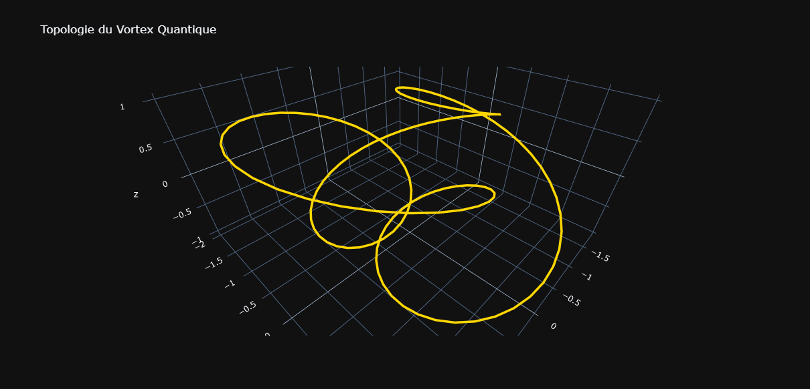

🌀 Quantum-NS Ultra

Simulateur de Dynamique des Fluides Topologiques par Intelligence Artificielle (PINN)

Quantum-NS Ultra est un projet de recherche explorant l'intersection entre la mécanique des fluides, la topologie mathématique et le Deep Learning. Ce système utilise des réseaux de neurones informés par la physique (Physics-Informed Neural Networks) pour prédire la vorticité quantique au sein de filaments de vortex complexes.

🚀 Fonctionnalités Clés
Génération Vectorisée : Création instantanée de datasets massifs (10 000+ simulations) utilisant les équations paramétriques de nœuds topologiques célèbres (Trèfle, Figure-8, Cinquefoil).

Architecture Physics-ResNet : Réseau de neurones à blocs résiduels permettant une capture fine des instabilités physiques sans perte de signal.

Contraintes PINN : Intégration des principes physiques (Navier-Stokes, conservation d'énergie) directement dans la fonction de perte pour garantir des prédictions réalistes.

Visualisation 3D Interactive : Rendu dynamique des filaments de vortex via Plotly pour une analyse structurelle approfondie.

Bridge de Données Réelles : Pipeline d'importation conçu pour traiter les données issues de codes CFD (OpenFOAM, Ansys) ou de mesures expérimentales.

🔬 Fondements Scientifiques
L'objectif est d'étudier comment la géométrie d'un filament influence la distribution de la vorticité. Le modèle analyse :

La topologie du nœud (Invariants mathématiques).

La viscosité cinématique du fluide.

Le gradient de vitesse local.

🛠️ Installation & Utilisation
Prérequis
Bash

pip install numpy torch plotly pandas scikit-learn
Exécution du pipeline
Pour générer les données, entraîner l'IA et visualiser les résultats :

Bash

python quantum_ultra.py
📂 Structure du Dépôt
quantum_ultra.py : Code source principal (Moteur, IA, Visualisation).

requirements.txt : Liste des dépendances Python.

.gitignore : Filtre pour maintenir un dépôt propre (exclut les caches et modèles lourds).

LICENSE : Licence MIT pour une diffusion libre et protégée.

✍️ Auteur
Projet développé avec passion par un chercheur indépendant, passionné par la transmission du savoir et les nouvelles frontières de l'IA physique.

Sous licence MIT - Libre pour la recherche et l'éducation.
